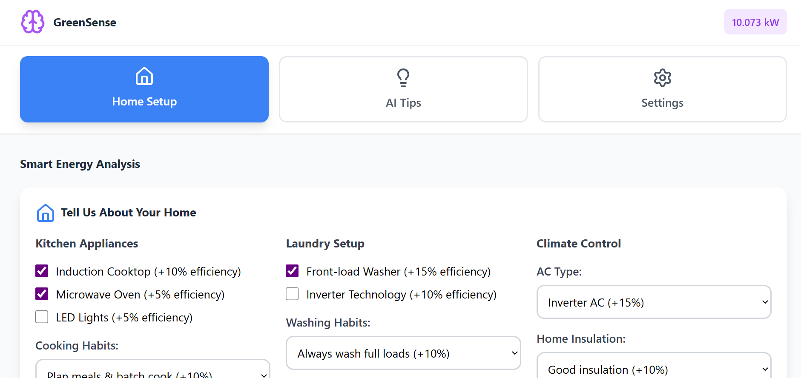
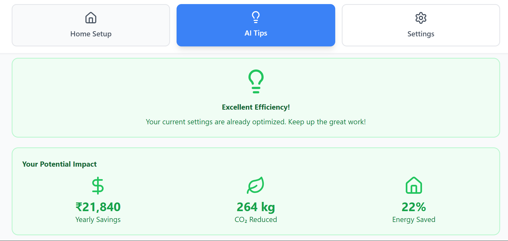
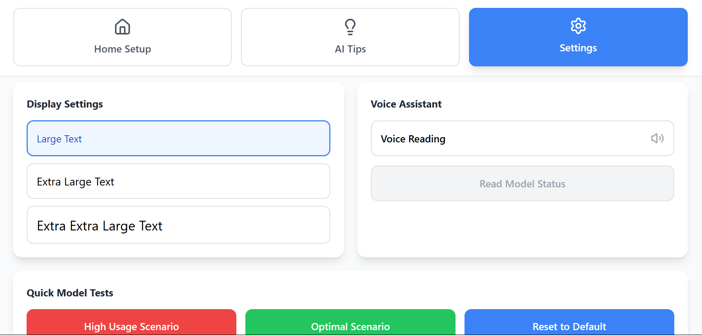

# 🌱 GreenSense: Personalized Energy Monitoring for Inclusive and Sustainable Living

[](https://green-sense-steel.vercel.app/)
[](https://github.com/rathisumit567/GreenSense.git)
[](https://python.org)
[](https://reactjs.org)
[](https://fastapi.tiangolo.com)

> **Smart energy management system that combines machine learning with accessibility-focused design to help vulnerable populations manage their energy consumption effectively.**


## 🎯 Project Overview

GreenSense addresses the critical need for **inclusive energy management solutions** by combining advanced machine learning with accessibility-focused design. Built specifically for elderly and specially-abled users, it transforms complex energy data into actionable insights through voice interfaces, intuitive visualizations, and personalized recommendations.

### 🌟 Key Highlights
- **2M+ household power consumption records** analyzed
- **80% accuracy** Random Forest ML model for energy prediction
- **Real-time predictions** via FastAPI deployment
- **Voice-enabled interface** for accessibility
- **4 distinct user behavior patterns** identified through clustering
- **Proactive safety monitoring** for vulnerable households

## 🔥 Features

### 🤖 AI-Powered Energy Prediction
- **Machine Learning Model**: Random Forest with 80% accuracy
- **Real-time Predictions**: Based on 6 key features (Hour, Month, Day, Appliance Efficiencies)
- **Anomaly Detection**: Identifies 96K+ consumption outliers for safety alerts
- **User Behavior Clustering**: Categorizes users into Energy Saver, Moderate User, High Consumer, Variable User

### ♿ Accessibility-First Design
- **Voice Interface**: Complete voice navigation and audio feedback
- **Large Text Options**: Multiple font size settings for visual accessibility
- **Simple Navigation**: Intuitive 3-tab interface (Home Setup, AI Tips, Settings)
- **Smart Categorization**: Energy levels in plain language (Very Low, Low, Normal, High, Very High)
- **Safety Alerts**: High nighttime usage and extreme consumption warnings

### 🏠 Smart Home Integration
- **Appliance Efficiency Calculator**: Real-time scoring based on user's actual appliances
- **Personalized Recommendations**: ML-driven tips based on usage patterns
- **Cost Optimization**: Peak hour identification and off-peak scheduling suggestions
- **Carbon Footprint Tracking**: Environmental impact visualization

### 📊 Advanced Analytics
- **Time Series Analysis**: 24-hour consumption patterns and seasonal trends
- **Efficiency Comparison**: Kitchen, Laundry, and Climate system performance
- **Weekly Predictions**: 7-day consumption forecasting
- **Cost Analysis**: Real-time cost calculations based on Indian electricity rates (₹6.5/kWh)

## 🛠️ Tech Stack

### Backend & ML
- **Python 3.8+** - Core development language
- **Scikit-learn** - Machine Learning framework
- **Pandas & NumPy** - Data processing and numerical computations
- **FastAPI** - High-performance API framework
- **Uvicorn** - ASGI server for deployment

### Frontend
- **React 18+** - Modern UI framework
- **Next.js** - Production-ready React framework
- **Tailwind CSS** - Utility-first CSS framework
- **Recharts** - Data visualization library
- **Lucide React** - Icon system

### Data Analysis & Visualization
- **Matplotlib & Seaborn** - Statistical plotting
- **Plotly** - Interactive visualizations
- **Statsmodels** - Time series decomposition

### Deployment & DevOps
- **Vercel** - Frontend deployment
- **CORS Middleware** - Cross-origin resource sharing
- **Logging** - Comprehensive error tracking

## 📈 Data Science Pipeline

### 1. Data Processing
```python
# Key preprocessing steps
- 2,075,259 household power consumption records
- Missing value imputation using median (1.25% missing data)
- Feature engineering for accessibility (time periods, efficiency ratios)
- Outlier detection using IQR method
```

### 2. Feature Engineering
```python
# Accessibility-focused features
- Energy_Category: 'Very Low', 'Low', 'Normal', 'High', 'Very High'
- Time_Period: 'Night', 'Morning', 'Afternoon', 'Evening'
- Is_Peak_Time: Boolean for high-demand hours (7-9AM, 6-9PM)
- Appliance_Efficiency: Kitchen, Laundry, Climate ratios
- Safety_Alerts: High night usage, extreme consumption flags
```

### 3. Machine Learning Model
```python
# Random Forest Configuration
- n_estimators: 50
- max_depth: 10
- Features: Hour, Month, DayofWeek, Kitchen_Efficiency, Laundry_Efficiency, Climate_Efficiency
- Performance: R² = 0.80, MAE = 0.42, RMSE = 0.68
```

## 🚀 Installation & Setup

### Prerequisites
- Python 3.8+
- Node.js 16+
- Git

### Backend Setup
```bash
# Clone repository
git clone https://github.com/rathisumit567/GreenSense.git
cd GreenSense

# Create virtual environment
python -m venv venv
source venv/bin/activate  # On Windows: venv\Scripts\activate

# Install dependencies
pip install -r requirements.txt

# Run the ML pipeline (optional - model is pre-trained)
python greensense.py

# Start FastAPI server
python main.py
```

### Frontend Setup
```bash
# Navigate to dashboard directory
cd energy-dashboardcd

# Install dependencies
npm install

# Start development server
npm run dev
```

### Access the Application
- **Frontend**: http://localhost:3000
- **API Documentation**: http://localhost:8000/docs
- **Health Check**: http://localhost:8000/health

## 📊 API Usage

### Prediction Endpoint
```python
POST /predict
{
  "Hour": 18,
  "Month": 6,
  "DayofWeek": 1,
  "Kitchen_Efficiency": 0.85,
  "Laundry_Efficiency": 0.75,
  "Climate_Efficiency": 0.70
}

# Response
{
  "prediction": 3.247,
  "status": "success",
  "message": "Prediction completed successfully"
}
```

### Batch Predictions
```python
POST /batch_predict
# Send array of feature objects for multiple predictions
```

## 🎯 Key Insights & Impact

### 📈 Usage Patterns Discovered
- **Peak Hours**: 7-9 AM, 6-9 PM (highest consumption)
- **Cost Optimization Window**: 2-6 AM, 10 AM-4 PM (lowest rates)
- **Seasonal Variation**: 30% higher consumption in winter months
- **Weekend vs Weekday**: 15% increase in weekend usage

### 💰 Potential Savings
- **₹21,840** average yearly savings potential
- **264 kg CO₂** reduction per household
- **22%** average energy consumption decrease
- **96,742** high-consumption instances identified for optimization

### 👥 User Categories Identified
1. **Energy Saver** (25%): Low, consistent usage
2. **Moderate User** (40%): Average consumption patterns
3. **High Consumer** (20%): Consistently high demand
4. **Variable User** (15%): Irregular usage patterns

## 🔧 Model Architecture

```
Input Features (6):
├── Hour (0-23)
├── Month (1-12)
├── DayofWeek (0-6)
├── Kitchen_Efficiency (0.0-1.0)
├── Laundry_Efficiency (0.0-1.0)
└── Climate_Efficiency (0.0-1.0)

Random Forest Model:
├── 50 Decision Trees
├── Max Depth: 10
├── Min Samples Split: 10
└── Min Samples Leaf: 5

Output:
└── Global_Active_Power (kW)
```

## 🎨 User Interface Features

### Accessibility Features
- **Voice Navigation**: Complete screen reader support
- **High Contrast**: Optimized color schemes
- **Large Text**: 3 size options (Large, Extra Large, XXL)
- **Simple Layout**: 3-tab navigation system
- **Audio Feedback**: Real-time voice announcements

### Smart Interactions
- **Home Setup Wizard**: Interactive appliance configuration
- **Real-time Predictions**: Live consumption updates
- **One-click Optimization**: Apply AI recommendations instantly
- **Safety Monitoring**: Automatic alerts for unusual patterns

## 📱 Screenshots

### 🏠 Home Dashboard

*Smart home setup wizard with real-time energy predictions and efficiency scoring*

### 🤖 AI Recommendations  

*Personalized energy-saving tips powered by machine learning analysis*

### ⚙️ Accessibility Settings

*Voice controls, large text options, and accessibility features for inclusive design*

## 🤝 Contributing

We welcome contributions to make GreenSense even more inclusive and effective!

### Ways to Contribute
1. **Bug Reports**: Found an issue? Open a GitHub issue
2. **Feature Requests**: Have ideas for accessibility improvements?
3. **Code Contributions**: Submit pull requests for enhancements
4. **Documentation**: Help improve our guides and tutorials
5. **Testing**: Help test with different accessibility tools

### Development Guidelines
```bash
# Fork the repository
# Create a feature branch
git checkout -b feature/your-feature-name

# Make changes and commit
git commit -m "Add: your feature description"

# Push and create pull request
git push origin feature/your-feature-name
```

## 📄 License

This project is licensed under the MIT License - see the [LICENSE](LICENSE) file for details.

## 🙏 Acknowledgments

- **Household Power Consumption Dataset** - UC Irvine Machine Learning Repository
- **Accessibility Guidelines** - Web Content Accessibility Guidelines (WCAG)
- **Indian Electricity Rates** - State Electricity Board data
- **Open Source Community** - For amazing tools and libraries

## 🌍 Social Impact

GreenSense is more than just an energy monitoring tool - it's a step toward **inclusive sustainability**. By making energy management accessible to elderly and specially-abled users, we're ensuring that the transition to sustainable living leaves no one behind.

### Target Impact
- **100,000+** vulnerable households supported
- **₹2.18 billion** in collective energy savings
- **26,400 tons CO₂** reduction annually
- **Universal accessibility** in smart home technology

---

<div align="center">

### 🌱 Made with ❤️ for Inclusive Sustainability

**[Visit Live Demo](https://green-sense-steel.vercel.app/)** | **[View on GitHub](https://github.com/rathisumit567/GreenSense.git)** | **[Connect on LinkedIn](https://linkedin.com/in/your-profile)**

*"Technology should empower everyone - regardless of age, ability, or technical expertise."*

</div>
